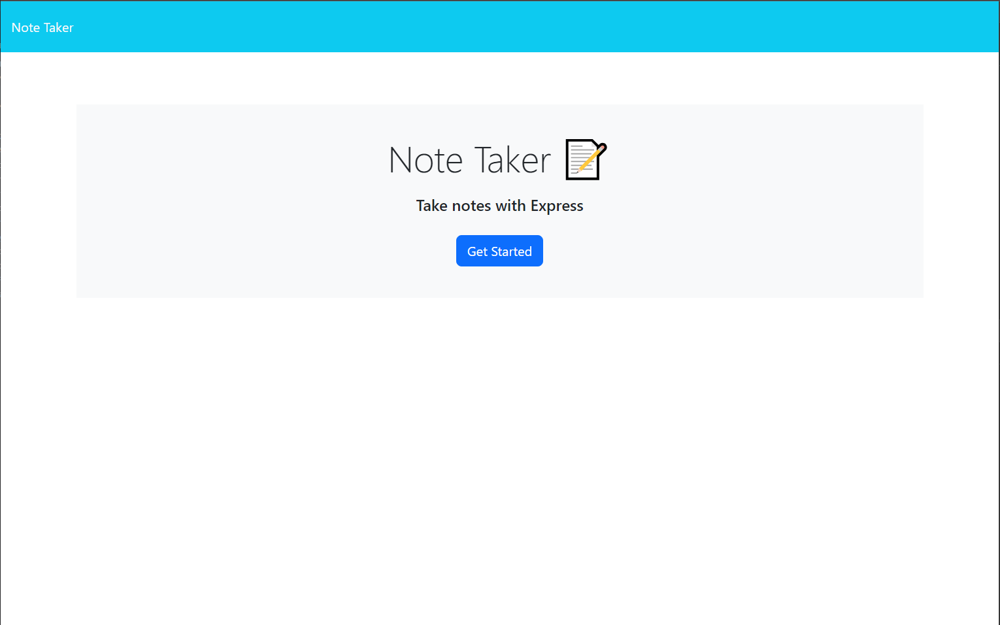

# Note-Taker
  
  ## Description
  This is a note taker application that implements expressJS and hosted by Render.
  ## Table of Contents
  [Installation](#installation) ||
 [Usage](#usage) ||
 [Contibuting](#contributing) ||
 [Questions](#questions) 

  ## Installation
  1. Clone the current repo.
  2. Make sure you have Node installed.
  3. Use `NPM i` in your CLI at the root of the repo to download the ExpressJS dependancy.
  4. If you would like to test the application locally. Enter `node server.js` within your CLI at the root of the repo. A console.log will appear which will allow you to copy that into a browser.

  ## Usage
  Website link. https://note-taker-kkdn.onrender.com/

  ## Contributing
  Meg Meyers

  ## Questions
  Please reach out to me at the resources given below. 

  ###  Github Username: Tyler-Cav 
 ### Github Link 
https://github.com/Tyler-Cav
